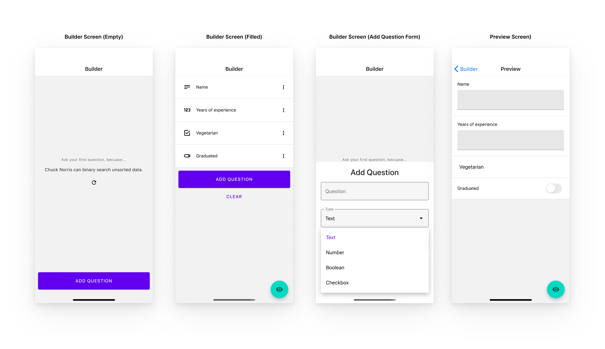

# LionForm
MoneyLion Take-Home Assignment

## Task Description
Write a React Native application that serves as a dynamic form builder. The application should be able to accept Field Name (text input) and Type (dropdown) for creating each form entry. 4 types such as Text, Number, Boolean, and Checkbox should be supported for each entry. Users can freely create as many entries as possible.

## Screens

